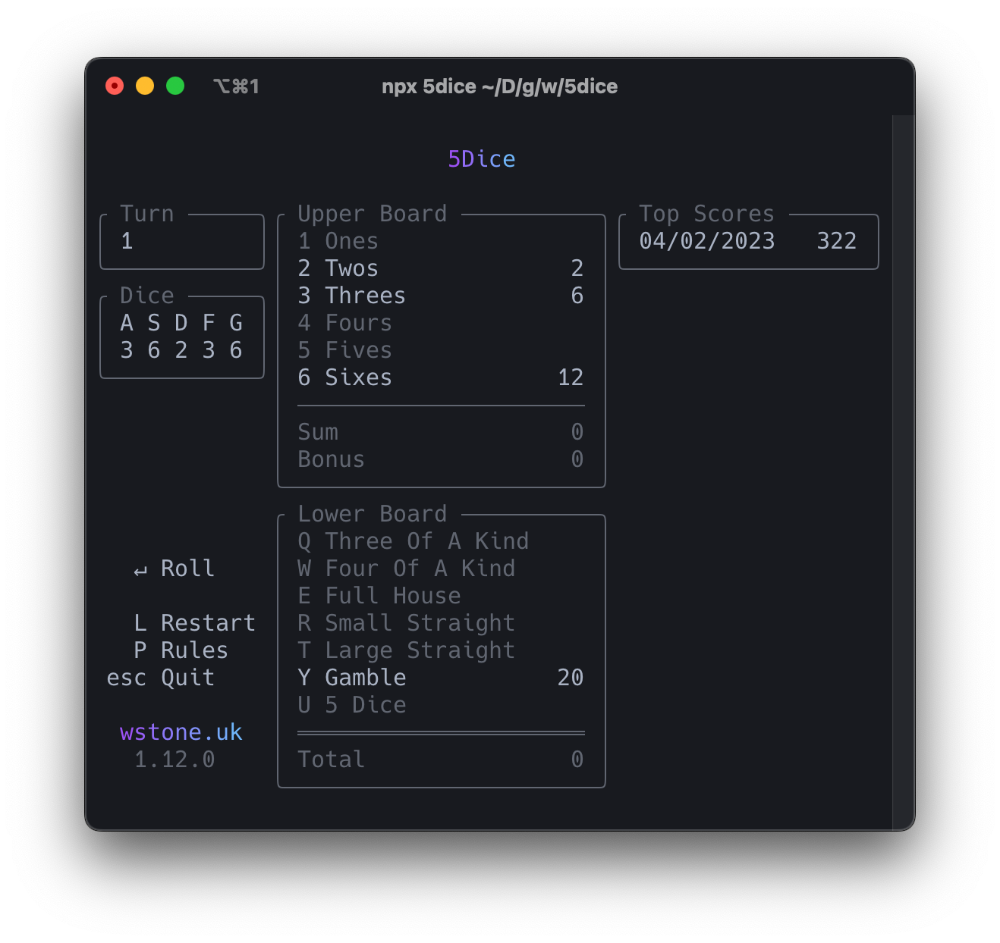

<div align="center">
	<br>
	
	<br>
	<br>
	<br>
	
</div>

# 5Dice

A 5 dice game to play in the terminal. Any similarities with Yahtzee are
completely coincidental.

NB: this saves your scores to a `5dice.json` file in the directory it is run.

## Play

```bash
npx 5dice
```

## Development

Install dependencies:

```bash
npm i
```

Run in watch mode:

```
npm start
```
